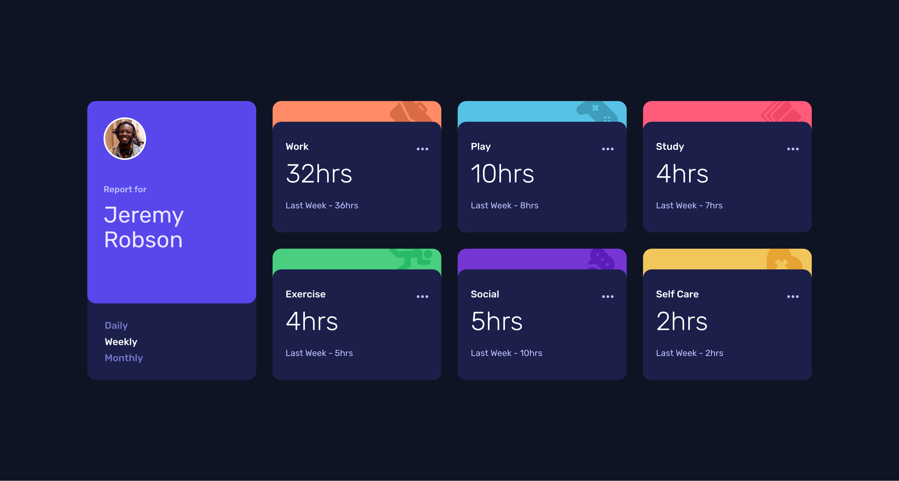

# Frontend Mentor - Time tracking dashboard solution

This is a solution to the [Time tracking dashboard challenge on Frontend Mentor](https://www.frontendmentor.io/challenges/time-tracking-dashboard-UIQ7167Jw). Frontend Mentor challenges help you improve your coding skills by building realistic projects.

## Table of contents

- [Overview](#overview)
  - [The challenge](#the-challenge)
  - [Screenshot](#screenshot)
  - [Links](#links)
- [My process](#my-process)
  - [Built with](#built-with)
  - [Useful resources](#useful-resources)
- [Author](#author)

## Overview

### The challenge

Users should be able to:

- View the optimal layout for the site depending on their device's screen size
- See hover states for all interactive elements on the page
- Switch between viewing Daily, Weekly, and Monthly stats

### Screenshot

### Links

- Solution URL: [https://github.com/ricllima/Frontend-Mentor---Time-tracking-dashboard](https://github.com/ricllima/Frontend-Mentor---Time-tracking-dashboard)
- Live Site URL: [https://ricllima.github.io/Frontend-Mentor---Time-tracking-dashboard](https://ricllima.github.io/Frontend-Mentor---Time-tracking-dashboard)

## My process

### Built with

- Semantic HTML5 markup
- CSS custom properties
- Flexbox
- CSS Grid
- Mobile-first workflow
- [Vite](https://vite.dev/) - Build tool

### Useful resources

- [Deploying a Static Site | Vite](https://vite.dev/guide/static-deploy) - This helped me deplying a Vite project to GitHub Pages.

## Author

- Frontend Mentor - [@ricllima](https://www.frontendmentor.io/profile/ricllima)
